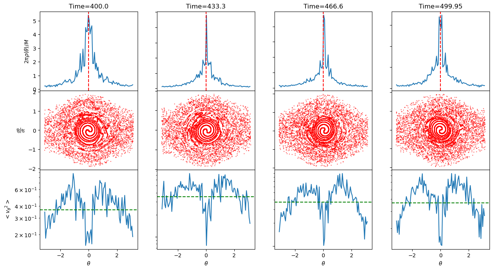
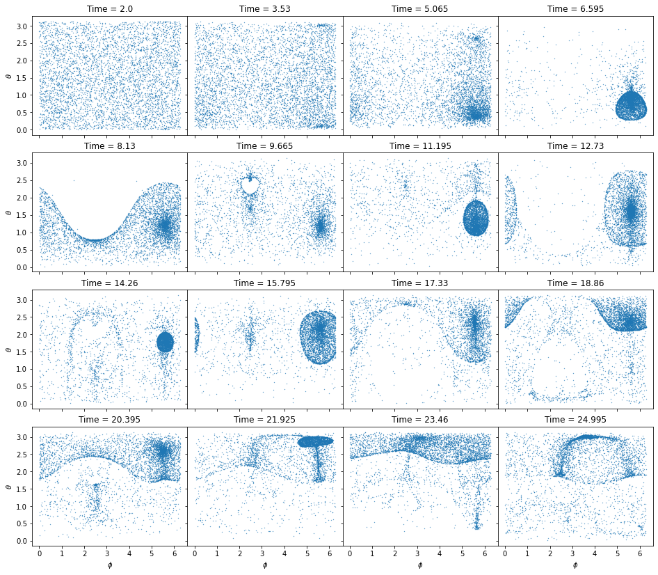

# Hamiltonian Mean Field (HMF) Simulations

This repository contains work on the **Hamiltonian Mean Field (HMF) model** in both one and two dimensions, with ongoing extensions toward applications in **financial market microstructure**.

---

## Project Overview

The HMF model is a simplified $N$-body system with long-range cosine interactions.  
- In **1D**, particles lie on a circle and interact through the cosine of their angular separation.  
- In **2D**, particles are constrained to a sphere, with interactions depending on angular distance across great circles.  

These systems are classic in statistical mechanics because they display clustering, collective phases, and non-equilibrium instabilities. The same features make them promising analogies for **order book dynamics** in financial markets, where liquidity and volatility emerge from collective trader behavior.

---

## Core Contributions

- **1D-HMF Simulations**  
  - Implemented using a second-order Runge–Kutta scheme.  
  - Explored equilibrium density and velocity dispersion profiles.  
  - Tested Maxwell–Boltzmann distribution predictions against $N$-body simulations.  
  - Demonstrated phase transitions: uniform → clustered states below a critical temperature.  

- **2D-HMF Simulations**  
  - Developed a **kick–drift–kick integration scheme** with a double-cover method to handle spherical coordinate singularities.  
  - Showed collapse/dispersion cycles and the absence of stable clustering equilibria.  
  - Connected dynamics to **radial orbit instabilities**, an important phenomenon in astrophysical systems.  

- **Numerical Techniques**  
  - Runge–Kutta (RK2) for 1D.  
  - Modified leap-frog / kick–drift–kick scheme for 2D.  
  - Double-cover method for stability near poles.

---

## Example Results

- **1D HMF Phase Space Evolution**  
  

- **2D HMF Phase Space Evolution**  
  

These figures illustrate how clustering and collective oscillations emerge naturally from the HMF dynamics.

---

## Why This Matters for Finance

Although developed for astrophysical systems (e.g., dark matter halos), the HMF framework has a natural mapping to markets:

- **Particles ↔ Orders**: Each particle corresponds to a limit order in the book.  
- **Angles ↔ Price Levels**: A particle’s angular position represents relative price depth from the midprice.  
- **Weights ↔ Order Sizes**: Particle mass = order volume.  
- **Order Parameter (Magnetization $M$)**: Captures how concentrated orders are around best bid/ask → a **tightness/liquidity measure**.  
- **Phase Transitions**: Analogous to fragile vs. resilient market regimes.  
- **Instabilities (2D case)**: Map to liquidity shocks and volatility bursts in the order book.

By combining **1D tightness (liquidity clustering)** and **2D instabilities (fragility)**, this project sets up a physics-based framework for **forecasting spreads, depth resilience, and short-horizon volatility**.

---

## Repository Structure

- `/src` – core simulation code for 1D and 2D HMF.  
- `/notebooks` – Jupyter notebooks with visualizations and analysis.  
- `/docs` – full thesis write-up and derivations.  
- `README.md` – project overview (this file).  

---

## Status & Next Steps

This repository currently provides the physics simulation framework and results from the thesis. Next steps will focus on **bridging physics and finance**:

1. Extend HMF simulations to synthetic order book data.  
2. Define an HMF-based “tightness” index as a liquidity proxy.  
3. Explore connections between clustering/instabilities and **volatility spikes** in real high-frequency trading data.  
4. Package code for reproducibility and add interactive visualization of order parameter dynamics.

---

